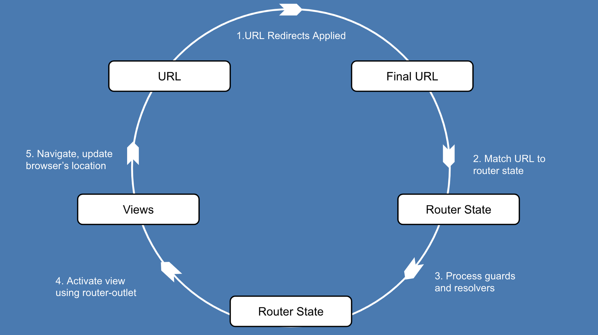
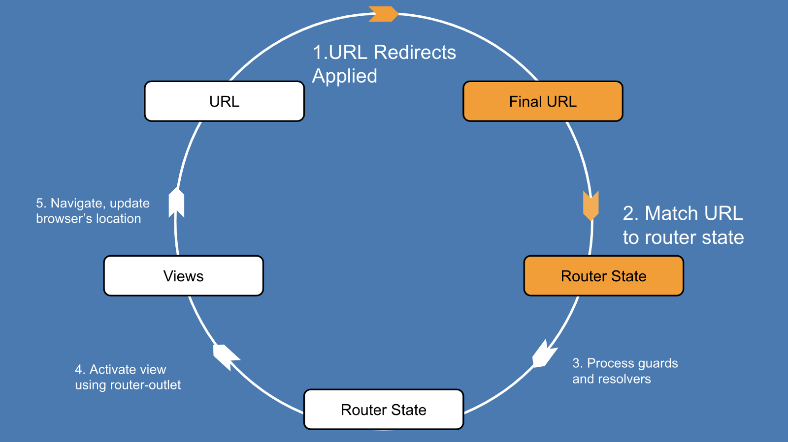
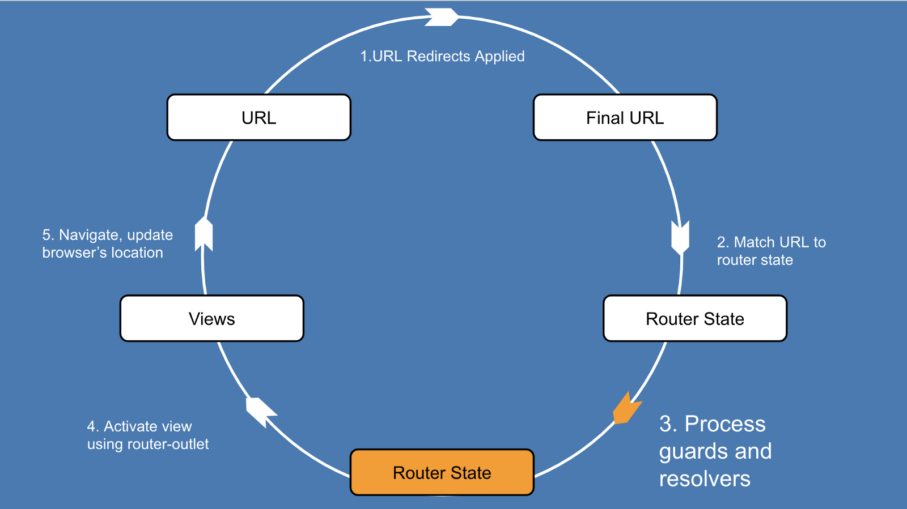
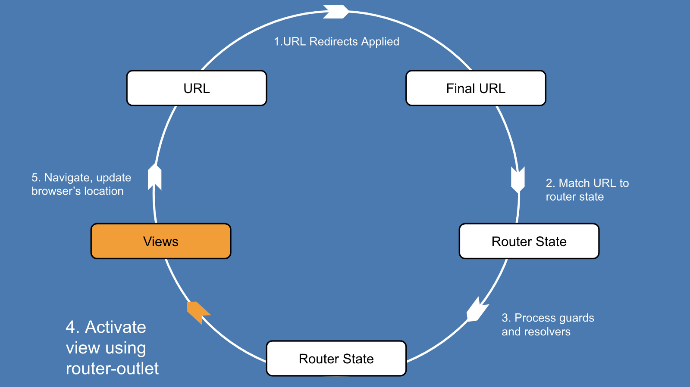
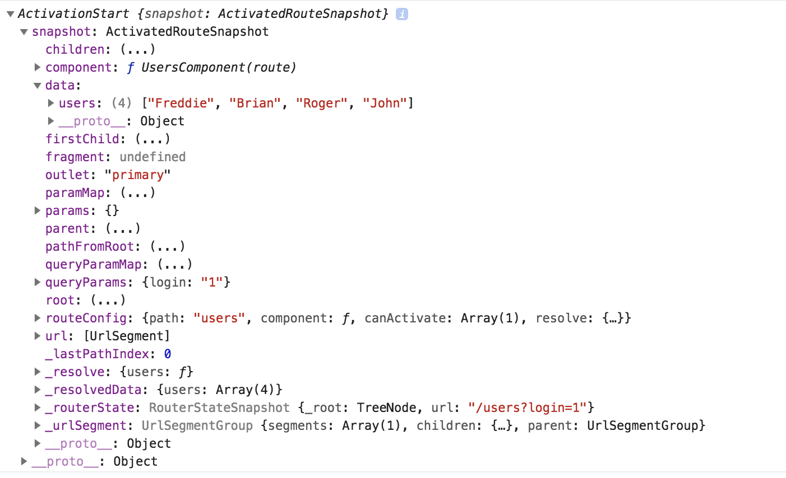
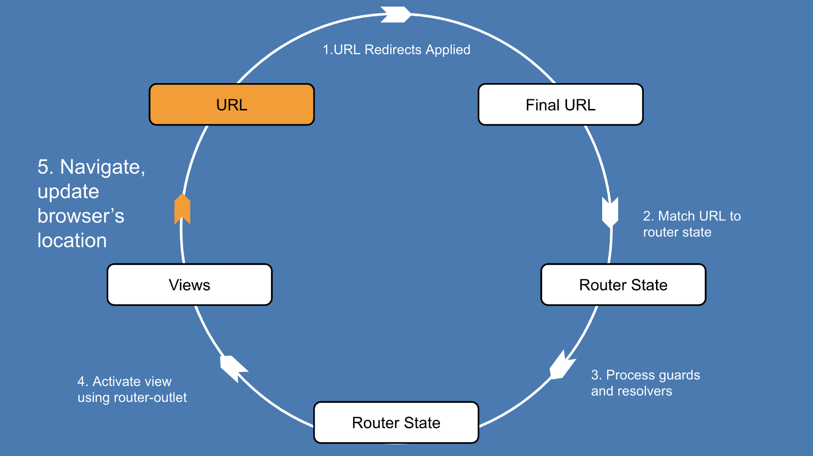

# [翻译] Angular 路由器系列三部曲之二: 理解路由器导航循环

> 原文链接：**[Angular Router Series: Pillar 2 — Understanding The Router’s Navigation Cycle](https://blog.angularindepth.com/angular-router-series-pillar-2-navigation-d050286bf4fa)**
>
> 原文作者: **[Nate Lapinski](https://blog.angularindepth.com/@natelapinski)**
>
> 译者: **[dreamdevil00](https://github.com/dreamdevil00)**；校对者：


**路由对于任何前端框架或库来说都是必不可少的**。它允许我们只加载应用程序一次，即可通过客户端路由向用户显示不同的内容，从而使单页应用成为可能。

开始使用 Angular 的路由器(router)很容易，但是你有没有想过，当你在 Angular 应用中点击一个链接时，到底发生了什么? 在本文中，我们将回答这个问题和更多内容。**通过了解路由器的导航循环(cycle)，可以对 Angular 有很多深入的了解**。

在本文结束时，你将明白路由器在导航时必须问自己的三个问题:

1. **对于给定的 URL，我应该导航到哪一组组件?**

2. **我可以导航到这些组件么?**

3. **我应该为这些组件预取数据么?**

在此过程中，我们将详细了解以下内容。

- 整个路由过程， 从开始到结束

- 在导航期间和之后, 路由器如何构建和使用 ActivatedRouteSnapshot 对象树

- 使用 `<router-outlet>` 指令渲染内容(content)



我们来个小旅行，看看在 Angular 应用中路由时会发生什么

## 导航

在 Angular 中，我们构建单页应用。这意味着当 URL 改变时，我们实际上并不会从服务器加载新页面。相反，路由器在浏览器中提供基于位置的导航，[这对于单页应用来说是必不可少的](https://blog.angular-university.io/why-a-single-page-application-what-are-the-benefits-what-is-a-spa/)。它允许我们在不刷新页面的情况下改变用户看到的内容以及 URL。

每当 URL 改变时就会发生导航(路由)。我们需要一种在应用视图之间导航的方法，而带有 href 的标准锚标记将不起作用，因为这将触发整个页面的重载。这就是 Angular 为我们提供 `[routerLink]` 指令的原因。当点击时，它告诉路由器更新 URL 并使用 `<router-outlet>` 指令渲染内容，而无需重载页面。

```html
<!-- without a routerLink -->
<a href='localhost:4200/users'>Users</a>  <!-- not what we want! -->
<!-- with a routerLink -->
<a [routerLink]="['/users']">Users</a>  <!-- router will handle this -->
```

对于每次导航，在路由器在屏幕上渲染新组件之前，会执行一系列步骤。这就是路由器导航生命周期。

成功导航的输出是: 使用 `<router-outlet>` 渲染新组件，创建 ActivatedRoute 数据结构树并作为导航的可查询记录。[如果你想知道更多关于激活路由和路由器状态的信息，我已经在这里写过了](https://blog.angularindepth.com/angular-routing-series-pillar-1-router-states-and-url-matching-12520e62d0fc#2670)。出于我们的目的，只要知道路由器和开发人员都使用激活的路由来提取关于导航的信息，例如查询参数和组件。

## 示例应用

我们将使用一个非常简单的应用作为运行示例。这是路由器配置。

```typescript
const ROUTES = [
  {
    path: 'users',
    component: UsersComponent,
    canActivate: [CanActivateGuard],
    resolve: {
      users: UserResolver
    }
  }
];
```

示例应用可以在[这里](https://stackblitz.com/edit/angular-pillar-two-navigation-demo?embed=1&file=src/app/app.component.ts)找到。

该应用由一路由 `/users` 组成，它检查查询参数以查看用户是否登录(`login=1`)，然后显示它从模拟 API 服务检索到的用户名列表。

应用的细节并不重要。我们只需要一个示例来查看导航循环。

## 导航循环和路由事件

查看导航循环的一个好办法是订阅路由器服务的 `events` observable:

```typescript
constructor(private router: Router) {
  this.router.events.subscribe( (event: RouterEvent) => console.log(event))
}
```

在开发期间， 你可以在路由器配置中传入选项 `enableTracing: true`.

```typescript
RouterModule.forRoot(ROUTES, {
  enableTracing: true
})
```

在开发者控制台里， 我们可以看到在导航到 `/users` 路由期间发出的事件:


这些事件对于研究或调试路由器非常有用。你也可以很容易地利用它们，在导航期间显示加载消息。

```typescript
ngOnInit() {
  this.router.events.subscribe(evt => { 
    if (evt instanceof NavigationStart) {
      this.message = 'Loading...';
      this.displayMessage = true;
    }
    if (evt instanceof NavigationEnd) this.displayMessage = false;
  });
}
```
摘录自 app.component.ts。在导航开始时显示加载中，并在导航结束后清除该消息。

我们运行个指向 `/users` 的导航

## 导航开始(Navigation Start)
*events: NavigationStart*

在我们的示例应用中， 用户首先单击以下链接:

`<a [routerLink]="['/users']" [queryParams]="{'login': '1'}">Authorized Navigation</a>`

导航到 /users, 传入查询参数 login=1(详情请看路由守卫一节)

每当路由器检测到对路由器链接指令的点击时，它就会启动导航循环。启动导航也有必要的方法，例如路由器服务的 `navigate` 和 `navigateByUrl` 方法。

以前，可以同时运行多个导航(因此需要导航 id)，[但是由于此更改，一次只能有一个导航](https://github.com/angular/angular/commit/b7baf632c0161692f15d13f718329ab54a0f938a)。

## URL 匹配以及重定向
*events: RoutesRecognized*



路由器首先通过路由器配置数组(我们的示例中的 `ROUTES`)进行深度优先搜索，并尝试将 URL `/users` 和路由器配置中的 `path` 属性相匹配，同时在此过程中应用重定向。[如果你想知道此过程的细节，我在这里写了](https://blog.angularindepth.com/angular-routing-series-pillar-1-router-states-and-url-matching-12520e62d0fc#3284)。

在我们的例子中，无需担心重定向，URL `/users` 将匹配到 `ROUTES` 中的以下配置:

`{ path: 'users', component: UsersComponent, ... }`

如果匹配到的路径需要一个懒加载的模块， 那么它将在此时加载。

路由器发出 `RoutesRecognized` 事件，以表明它找到了与 URL 匹配的项，以及一个将要导航到的组件(UsersComponent)。这回答了路由器的第一个问题，“我应该导航到什么?”。 但是没有那么快，路由器必须确保它被允许导航到这个新组件。

进入路由守卫。

## 路由守卫(Route Guards)
*events: GuardsCheckStart, GuardsCheckEnd*


路由守卫是布尔函数，路由器使用它来确定是否可以执行导航操作。**作为开发人员，我们使用守卫(guards)来控制导航是否可以发生**。在我们的示例应用中，我们在路由配置中指定 [canActivate](https://angular.io/api/router/CanActivate) 守卫来检查用户是否已登录。

```typescript
{ path: 'users', ..., canActivate: [CanActivateGuard] }
```

守卫函数如下:

```typescript
canActivate(route: ActivatedRouteSnapshot, state: RouterStateSnapshot): boolean {
    return this.auth.isAuthorized(route.queryParams.login);
}
```
 当查询参数 login=1时， isAuthorized 会返回 true
 
 此守卫传递 `login` 查询参数到 `auth` 服务中(本例中为 `auth.service.ts`)
 
 如果对 `isAuthorized(route.queryParams.login)` 的调用返回了 `true`, 那么守卫传参成功。 否则， 守卫传参失败， 路由器会发出 `NavigationCancel` 事件， 然后放弃整个导航。
 
 其他的守卫(guards)包括 [canLoad](https://angular.io/api/router/CanLoad)(模块是否被懒加载)、[canActivateChild](https://angular.io/api/router/CanActivateChild) 和 [canDeactivate](https://angular.io/api/router/CanDeactivate)(这对于防止用户导航离开页面非常有用， 比如，填写表单时)。
 
 守卫类似于服务，它们被注册为提供者(providers)，并且是可注射(injectable)的。每当 URL 发生变化时，路由器都会运行守卫程序。
 
 **canActivate 守卫在为路由获取数据之前运行，因为没有理由为不应该被激活的路由获取数据**。一旦通过了守卫，路由器就回答了第二个问题:“我应该执行这个导航吗?”。路由器现在可以使用路由解析器(resolvers) 预取数据了。
 
 ## 路由解析器(Route Resolvers)
 *events: ResolveStart,ResolveEnd*



路由解析器是我们可以在导航的过程中，在路由器渲染任何内容之前用来预取数据的函数。类似于守卫，我们在路由配置中使用 resolve 属性指定解析器:

`{ path: 'users', ..., resolve: { users: UserResolver } }`

```typescript
// user.resolver.ts
export class UserResolver implements Resolve<Observable<any>> {
  constructor(private userService: MockUserDataService) {}

  resolve(): Observable<any> {
    return this.userService.getUsers();
  }
}
```

一旦路由器将 URL 匹配到某个路径，并且所有的守卫都通过了，它将调用 `UserResolver` 类中定义的 `resolve` 方法来获取数据。路由器将结果存储在 `ActivatedRoute` 服务的 `data` 对象的键(key) `users` 下。可以通过订阅 ActivatedRoute 服务的 `data` observable 来读取此信息。

`activatedRouteService.data.subscribe(data => data.users);`

在 UsersComponent 里使用 [ActivatedRoute 服务](https://angular.io/api/router/ActivatedRoute)， 从解析器里检索数据。

```typescript
export class UsersComponent implements OnInit {
  public users = [];

  constructor(private route: ActivatedRoute) {}

  ngOnInit() {
    this.route.data.subscribe(data => this.users = data.users);
  }
}
```

**解析器允许我们在路由期间预取组件数据**。这种技术可以通过预取数据来避免向用户显示部分加载的模板。请记住，在 `OnInit` 期间，组件的模板对用户是可见的，因此获取需要在该生命周期钩子中渲染的任何数据都可能导致部分页面加载。

**但是，通常最好让页面部分加载**。如果做得好，它将提高用户对站点的[感知性能](https://blog.teamtreehouse.com/perceived-performance)。是否预取数据取决于你，但通常最好是部分页面加载并有个漂亮的加载动画，而不是使用解析器。

在内部，路由器有个 `runResolve` 方法，它将执行解析器，并将结果存储在 ActivatedRoute 快照(snapshot)上。

```typescript
// pre_activation.ts
future.data = {...future.data,
               ...inheritedParamsDataResolve(future, paramsInheritanceStrategy).resolve};
```

一旦路由器处理了所有解析器，下一步就是使用适当的路由器出口(outlets)开始渲染组件。

## 激活路由
*events: ActivationStart, ActivationEnd, ChildActivationStart, ChildActivationEnd*



现在是时候激活这些组件，并使用 `<router-outlet>` 显示它们了。路由器可以从 ActivatedRouteSnapshots 树中提取它需要的关于组件的信息，ActivatedRouteSnapshots 树是它在导航循环的前几个步骤中构建的。




如果你不熟悉在 Angular 中创建动态组件的过程，[这里](https://blog.angularindepth.com/here-is-what-you-need-to-know-about-dynamic-components-in-angular-ac1e96167f9e)和[这里](https://netbasal.com/dynamically-creating-components-with-angular-a7346f4a982d)都有很好的解释。

所有的魔术发生在路由器的 `activateWith` 函数里:

```typescript
activateWith(activatedRoute: ActivatedRoute, resolver: ComponentFactoryResolver|null) {
  if (this.isActivated) {
    throw new Error('Cannot activate an already activated outlet');
  }
  this._activatedRoute = activatedRoute;
  const snapshot = activatedRoute._futureSnapshot;
  const component = <any>snapshot.routeConfig !.component;
  resolver = resolver || this.resolver;
  const factory = resolver.resolveComponentFactory(component);
  const childContexts = this.parentContexts.getOrCreateContext(this.name).children;
  const injector = new OutletInjector(activatedRoute, childContexts, this.location.injector);
  this.activated = this.location.createComponent(factory, this.location.length, injector);
  // Calling `markForCheck` to make sure we will run the change detection when the
  // `RouterOutlet` is inside a `ChangeDetectionStrategy.OnPush` component.
  this.changeDetector.markForCheck();
  this.activateEvents.emit(this.activated.instance);
}
```
摘录自 [router_outlet.ts](https://github.com/angular/angular/blob/master/packages/router/src/directives/router_outlet.ts#L125f)

不要强调细节，我在这里总结代码的要点:

- 在第 9 行，ComponentFactoryResolver 用于创建 `UsersComponent` 的实例。路由器从第 7 行ActivatedRouteSnapshot 中提取此信息。

- 在第 12 行，实际上创建了组件。`location` 是正指向的` <router-outlet> `的 ViewContainerRef。如果您曾经想知道为什么渲染的内容被放置为 `<router-outlet>` 的同级内容，而不是放在它的内部，那么可以通过[追寻 createComponent 内部的细节来找到详细信息](https://github.com/angular/angular/blob/master/packages/core/src/view/refs.ts#L199)。

- 在创建并激活组件之后，将调用 `activateChildRoutes`(未显示)。这样做是为了解释任何嵌套的 `<router-outlet>`，即子路由。

路由器将在屏幕上渲染组件。如果所渲染的组件有任何嵌套的 `<router-outlet>` 元素，路由器也将遍历并渲染这些元素。

## 更新 URL



导航循环的最后一步是更新 URL 到 `/users`.

```typescript
// router_link.ts
private updateTargetUrlAndHref(): void {
  this.href = this.locationStrategy.prepareExternalUrl(this.router.serializeUrl(this.urlTree));
}
```

路由器现在已经准备好侦听另一个 URL 变更，并重新开始导航循环。

在本系列的最后一部分中，我们将深入研究用于懒加载模块的路由器机制。感谢阅读，敬请期待!