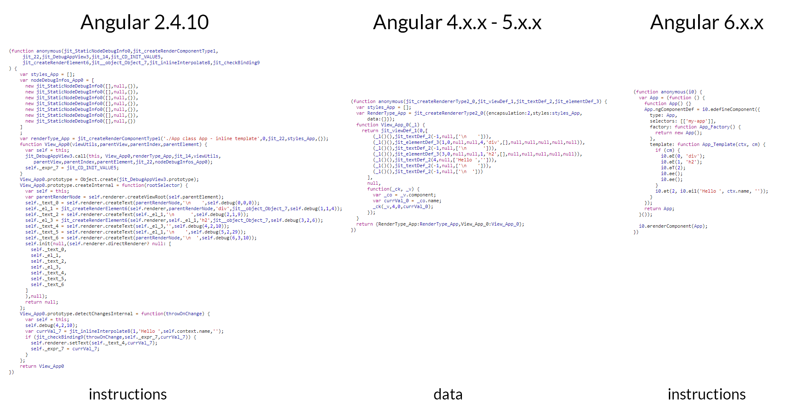
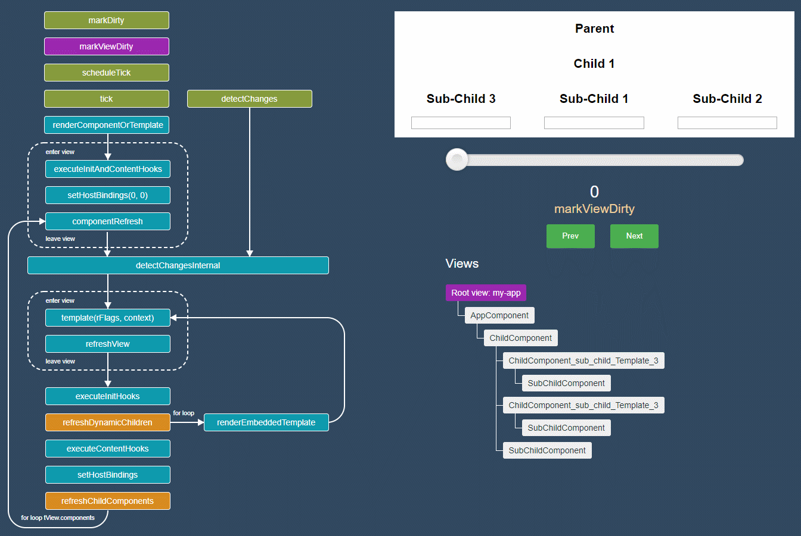
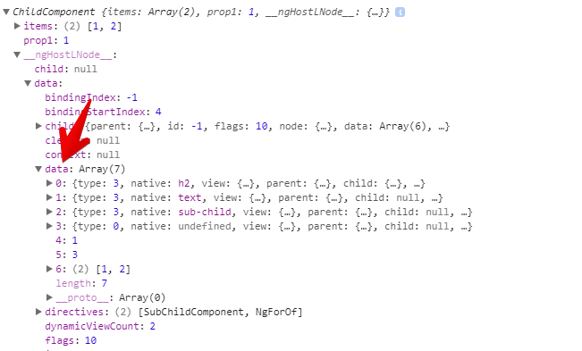
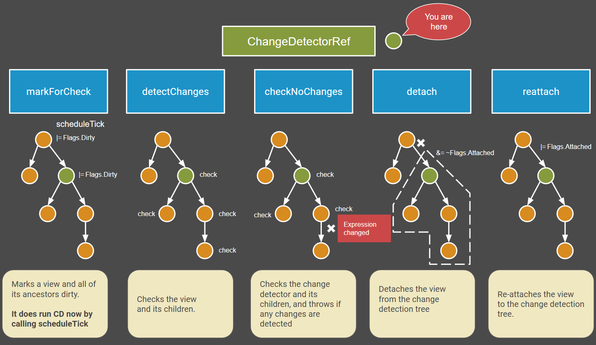
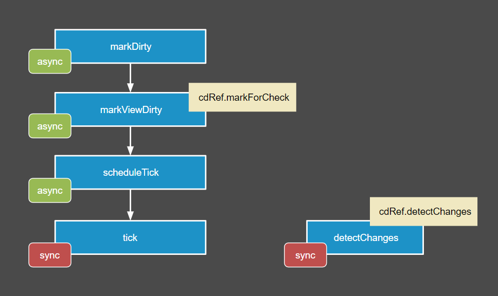
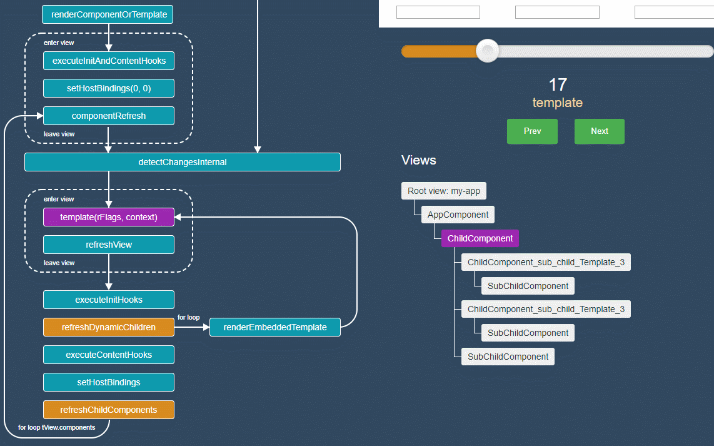
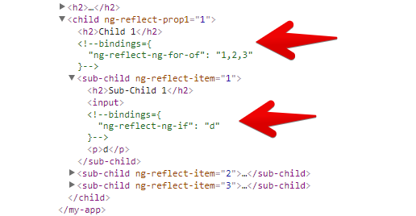
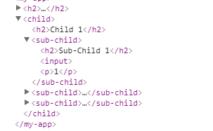
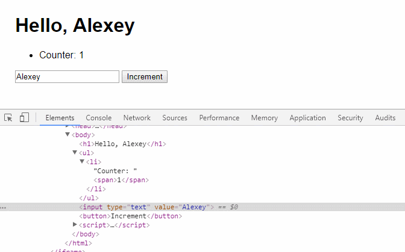

# Angular Ivy 执行变更检测

[原文链接](https://medium.com/angular-in-depth/angular-ivy-change-detection-execution-are-you-prepared-ab68d4231f2c)

[原作者:Alexey Zuev
](https://medium.com/@a.yurich.zuev?source=post_page-----ab68d4231f2c----------------------)

译者:[尊重](https://www.zhihu.com/people/yiji-yiben-ming/posts)

## 更新

试试 [Ivy jit 模式](https://alexzuza.github.io/ivy-jit-preview/)

## 求助

[如果你是 Angular In depth 的粉丝，请在 Twitter 上支持我们](https://blog.angularindepth.com/fan-of-angular-in-depth-and-my-writings-support-us-on-twitter-e3bfcbabb4b1)

> 免责声明：本文只是我个人对 new Angular renderer 的学习笔记。



虽然 Ivy 渲染引擎尚未完全公布，但是许多开发者希望了解 Ivy 的运作方式以及将会给开发者带来哪些变化。

在本文中，我们将可视化的方式展示 Ivy 的变更检测机制 ，除了展示那些激动人心的功能之外，还将从零开始指导你构建基于 Ivy 的 demo 应用。

## 正文

首先，介绍一下作为 demo 的应用


```Typescript
@Component({
  selector: 'my-app',
  template: `
   <h2>Parent</h2>
   <child [prop1]="x"></child>
  `
})
export class AppComponent {
  x = 1;
}
@Component({
  selector: 'child',
  template: `
   <h2>Child {{ prop1 }}</h2>
   <sub-child [item]="3"></sub-child>
   <sub-child *ngFor="let item of items" [item]="item"></sub-child>
  `
})
export class ChildComponent {
  @Input() prop1: number;
  
  items = [1, 2];
}
@Component({
  selector: 'sub-child',
  template: `
   <h2 (click)="clicked.emit()">Sub-Child {{ item }}</h2>
   <input (input)="text = $event.target.value">
   <p>{{ text }}</p>
  `
})
export class SubChildComponent {
  @Input() item: number;
  @Output() clicked = new EventEmitter();
  text: string;
}
```

我创建了一个[在线demo](https://alexzuza.github.io/ivy-cd/)，希望可以帮助你更好地理解本文内容。



demo 使用的是 Angular 6.0.1 的 aot 编译器。任何一个生命周期区块都可以点击，点击后将重定向到对应的定义页面。

为了触发行变更检测的运行流程，你只需要在 Sub-Child 组件的下方的输入框内键入文字即可。

## 视图

View 在 Angular 中是主要的底层抽象。

在上述例子中，view 的结构图如下所示：

```
Root view
   |
   |___ AppComponent view
          |
          |__ ChildComponent view
                 |
                 |_ Embedded view
                 |       |
                 |       |_ SubChildComponent view
                 |
                 |_ Embedded view
                 |       |
                 |       |_ SubChildComponent view   
                 |
                 |_ SubChildComponent view            
```

View 是用来描述模板的，所以其包含了用于反射模板结构的数据。

`ChildComponent` 的 View 中包含了以下模板：

```HTML
<h2>Child {{ prop1 }}</h2>
<sub-child [item]="3"></sub-child>
<sub-child *ngFor="let item of items" [item]="item"></sub-child>
```

当前的 view engine 使用 视图定义(view definition) factory 创建节点，并将节点存储在视图定义的 **nodes** 数组中。


Ivy 使用 `ngComponentDef.template` 函数创建 LNodes，并将其**存储**在 **data** 数组中：



除了 nodes 之外，Ivy view 于 data 数组中包含绑定信息（如上图中的 `data[4]`, `data[5]`, `data[6]`）。视图中的所有绑定均以其在模板中出现的顺序存储，存储的位置起始于 `bindingStateIndex` 参数的值

> 现在，如何才能获取 ChildComponent 的 view 实例呢？ 
> 
> **ComponentInstance.__ngHostLNode__** 包含了组件宿主节点的引用（或者使用注入 ChangeDetectorRef 的方式获取组件宿主节点）

通过这样的方式，Angular 首先创建 root view 并将宿主元素定位在 `data` 数组中下标为0的位置

```
RootView
   data: [LNode]
             native: root component selector
```

之后遍历所有组件并为每一个 view 填充 **data**。

## 变更检测

补充一下基础知识：`ChangeDetectorRef` 是一个抽象类，包含两个抽象方法 `detectChanges` 和 `markForCheck`。



当我们在组件的构造器中注入 `ChangeDetectorRef` 时，实际上获取的是从 `ChangeDetectorRef` 类拓展所得到的 **ViewRef** 实例。

现在，检查一下在 Ivy 中真正运行变更检测机制的内部方法。有些内部方法是公有 API（`markViewDirty` 和 `detectChanges`），但是并不是全部方法都是共有API。



### detectChanges 方法

以同步的方式在一个组件（及其子组件）上执行变更检测

> 本方法以同步的方式在一个组件上触发变更检测。只有当你有足够的理由时，才应当直接调用 `detectChanges` 方法触发变更检测；一般更推荐的方法是使用 `markDirty` 函数:等待未来的某个时间点通过调度器调用该函数。因为单个用户操作通常可能导致多个组件失效，与此同时，同时调用每个组件的变更检测非常低效。等到所有组件都被标记为 dirty 后，对所有组件执行单次变更检测更加高效。

```Typescript
export function detectChanges<T>(component: T): void {
  const hostNode = _getComponentHostLElementNode(component);
  ngDevMode && assertNotNull(hostNode.data, 'Component host node should be attached to an LView');
  const componentIndex = hostNode.tNode !.flags >> TNodeFlags.DirectiveStartingIndexShift;
  const def = hostNode.view.tView.directives ![componentIndex] as ComponentDef<T>;
  detectChangesInternal(hostNode.data as LView, hostNode, def, component);
}
```

### tick

用于在整个应用层面触发变更检测

> 与 `detectChanges` 方法相类似，只是 `tick` 方法在根组件上被调用。除此之外， `tick` 还会执行生命周期钩子并基于组件的 `ChangeDetectionStrategy` 和 `ditry` 状态有条件地检查组件。

```typescript
export function tick<T>(component: T): void {
  const rootView = getRootView(component);
  const rootComponent = (rootView.context as RootContext).component;
  const hostNode = _getComponentHostLElementNode(rootComponent);

  ngDevMode && assertNotNull(hostNode.data, 'Component host node should be attached to an LView');
  renderComponentOrTemplate(hostNode, rootView, rootComponent);
}
```

### scheduleTick

用于调度整个应用的变更检测计划。不像是 `tick`，`scheduleTick` 会将多个调用合并在一个变更检测轮旬中执行。当 view 需要重新渲染时，通常会通过调用 `markDirty` 方法间接调用`scheduleTick` 方法。

```Typescript
export function scheduleTick<T>(rootContext: RootContext) {
  if (rootContext.clean == _CLEAN_PROMISE) {
    let res: null|((val: null) => void);
    rootContext.clean = new Promise<null>((r) => res = r);
    rootContext.scheduler(() => {
      tick(rootContext.component);
      res !(null);
      rootContext.clean = _CLEAN_PROMISE;
    });
  }
}
```

### markViewDirty（markForCheck）

将当前视图及其所有祖先视图标记为 `ditry`。

在 Angular 5中，该方法只会向上遍历并确保对所有的父级 views 进行检查。注意！在 Ivy 中，markForCheck 并不会触发任何变更检测循环。

```Typescript
export function markViewDirty(view: LView): void {
  let currentView: LView|null = view;

  while (currentView.parent != null) {
    currentView.flags |= LViewFlags.Dirty;
    currentView = currentView.parent;
  }
  currentView.flags |= LViewFlags.Dirty;

  ngDevMode && assertNotNull(currentView !.context, 'rootContext');
  scheduleTick(currentView !.context as RootContext);
}
```

### markDirty

将组件标记为 `dirty`（需要变更检测）

> 某个组件标记为 `dirty` 意味着调度器在未来的某个时间点将对该组件进行变更检测。对已被标记为 `dirty` 的组件再次标记不会产生额外的效果，组件还是保持原有的 `dirty` 状态。每一个组件树只会被调度一个变更检测。（使用不同的 `renderComponent` 所构造的组件拥有不同的处置器）。

```Typescript
export function markDirty<T>(component: T) {
  ngDevMode && assertNotNull(component, 'component');
  const lElementNode = _getComponentHostLElementNode(component);
  markViewDirty(lElementNode.view);
}
```

### checkNoChanges

没啥新的内容

--------------------------------------------------------------------

当我调试新的变更检测机制时，我发现我忘记安装 zone.js 了。但是很奇怪的是，就算没有 zone.js 应用也能正常运行，没有 zone 的依赖，没有 `cdRef.detectChanges` 或 `tick`，但是为什么？

基于当前设计，对于采用了 OnPush 的组件， Angular 只有在[这些](https://stackoverflow.com/questions/42312075/change-detection-issue-why-is-this-changing-when-its-the-same-object-referen/42312239#42312239)状况下才会触发变更检测。

这些规律同样也应用于 Ivy：

- [Input 的内容发生了变化](https://github.com/angular/angular/blob/43d62029f0e2da0150ba6f09fd8989ca6391a355/packages/core/src/render3/instructions.ts#L890)
- [组件/子组件的绑定事件触发](https://github.com/angular/angular/blob/43d62029f0e2da0150ba6f09fd8989ca6391a355/packages/core/src/render3/instructions.ts#L1743)
- 手动调用 `markForCheck`(Ivy 中是 markViewDirty)

`subChildComponent` 中存在一个 output 绑定，其通过 (input) 事件触发。应用第二个规则，将会调用 `markForCheck` 方法。我们已经知道 `markForCheck` 方法将会触发变更检测，这样就可以解释为什么就算没有 zone.js 应用也可以正常运行了。

**那个很有名的bug会怎么样 - ExpressionChangedAfterItHasBeenCheckedError**

这个问题还是存在的。

### 变更检测的错误

因为 Angular 开发组花了大量精力确保 Ivy 以正确的顺序处理所有生命周期钩子，这也就是意味着操作的顺序应当是相似的。

[Max NgWizard K](https://medium.com/u/bd29063a4857?source=post_page-----ab68d4231f2c----------------------) 的[博客](https://blog.angularindepth.com/ivy-engine-in-angular-first-in-depth-look-at-compilation-runtime-and-change-detection-876751edd9fd)更好的解释了这个问题

> 虽然操作很相似，但是操作的顺序似乎发生了一些改变。比如，Angular 首先检测子组件，然后检测嵌入的视图。


让我们返回到 demo 中的 ChildComponent

```HTML
<h2>Child {{ prop1 }}</h2>
<sub-child [item]="3"></sub-child>
<sub-child *ngFor="let item of items" [item]="item"></sub-child>
```

我的想法在是写一个常规的组件 `sub-child` 后，再写其他嵌入在视图中的组件。

现在以动态的方式看看这种实现：



上图可见，Angular 首先检查嵌入的视图，再检查常规的组件。在这个方面，和过去的视图引擎没有什么区别。

在 demo 中还有一个可选的 `run angular complier` 按钮，可以检测其他场景。

## One-time string initialization

假设有一个组件以一个字符串值的方式接受颜色参数。现在我们希望将该输入以字符串常量的形式传入：

```HTML
<comp color="#efefef"></comp>
```

这就是所谓的 One-time string initialization（一次性字符串初始化），针对这种状况 Angular 文档的[陈述](https://angular.io/guide/template-syntax#one-time-string-initialization)是这样的:

> Angular 设置了它，并遗忘了它

其实这意味着，Angular 将不再会对这个绑定做任何额外的检查。但是在 Angular 5 中，在 `updateDirectives` 函数被调用的阶段内，每一次变更检测循环都会对其进行检查。

```Typescript
unction updateDirectives(_ck,_v) {
   var currVal_0 = '#efefef';
  _ck(_v,1,0,currVal_0);
```

如果你希望更多相关内容，可以阅读[Netanel Basal](https://medium.com/u/b889ae02aa26?source=post_page-----ab68d4231f2c----------------------)的博客[Getting to Know the @Attribute Decorator in Angular](https://medium.com/u/b889ae02aa26?source=post_page-----ab68d4231f2c----------------------)

现在让我们看看在 Ivy 中，事情会变成什么样：

```Typescript
var _c0 = ["color", "#efefef"];
AppComponent.ngComponentDef = i0.ɵdefineComponent({ 
  type: AppComponent,
  selectors: [["my-app"]], 
  ...
  template: function AppComponent_Template(rf, ctx) { 
    // create mode
      if (rf & 1) {
        i0.ɵE(0, "child", _c0); <========== used only in create mode
        i0.ɵe();
      }
      if (rf & 2) {
        ...
      }
  }
})
```

上述代码中，Angular 编译器将常量存储在负责创建和更新组建的代码之外，只有在创建模式中使用它。

## Angular 不再为容器创建 text nodes

> 更新：[https://github.com/angular/angular/pull/24346](https://github.com/angular/angular/pull/24346)

即使你不了解 Angular ViewContainer 的工作原理，当你打开浏览器开发者工具时，你肯定曾会看到下述的图片内容：



> 在生产模式中，我们只会看到 `<!--->`

而下述是 Ivy 的输出：



虽然我不是100%确定，但是猜测当 Ivy 稳定后，上述截图的输出内容就是生成的模板结果了。

因此下述代码中的 `query` 将会返回 `null`:

```Typescript
@Component({
  ...,
  template: '<ng-template #foo></ng-template>'
})
class SomeComponent {
  @ViewChild('foo', {read: ElementRef}) query;
}
```

> Angular 将不会再通过 指向容器中被注释的 DOM 节点的原生元素 阅读 ElementRef 了。

## Incremental DOM(IDOM) from scratch

挺久之前，Google 发布了一个名为 [incremental DOM](https://medium.com/google-developers/introducing-incremental-dom-e98f79ce2c5f) 的库。

这个库专注于构建 DOM 树并允许动态更新 DOM 树。该库的设计理念并非旨在直接使用其创建 DOM 树，而是作为模板引擎的编译目标而存在。似乎， Ivy 和 `incremental DOM` 有些相似之处。

现在创建一个小 [demo](https://jsfiddle.net/yurzui/hqhq4khc) 帮助大家理解 IDOM 渲染的工作流程。

这个应用包含一个计数器并展示在 input 元素中输入的内容。


假设页面上已经存在了 `<inupt>` 元素和 `<button>` 元素：

```html
<input type="text" value="Alexey">
<button>Increment</button>
```

而我们所需要渲染的动态 HTML 看起来像是：

```HTML
<h1>Hello, Alexey</h1>
<ul>
  <li>
    Counter: <span>1</span>
  </li>
</ul>
```

为了渲染上述动态内容，我们需要 `elementOpen` `elementClose` 和 `text` 的“instructions”（我之所以这种方式为其命名，因为 Angular 使用这些名字作为 Ivys，可以被当做是某种特殊的虚拟 CPU）

首先我们需要些一个特殊的帮助函数遍历节点树：

```typescript
// The current nodes being processed
let currentNode = null;
let currentParent = null;

function enterNode() {
  currentParent = currentNode;
  currentNode = null;
}
function nextNode() {
  currentNode = currentNode ? 
    currentNode.nextSibling : 
    currentParent.firstChild;
}
function exitNode() {
  currentNode = currentParent;
  currentParent = currentParent.parentNode;
}
```

现在，我们写 instructions：

```typescript
function renderDOM(name) {
  const node = name === '#text' ? 
  	document.createTextNode('') :
    document.createElement(name);

  currentParent.insertBefore(node, currentNode);

  currentNode = node;

  return node;
}

function elementOpen(name) {
  nextNode();
  const node = renderDOM(name);
  enterNode();

  return currentParent;
}

function elementClose(node) {
  exitNode();

  return currentNode;
}

function text(value) {
  nextNode();
  const node = renderDOM('#text');

  node.data = value;

  return currentNode;
}
view rawidom.instruct
```

换句话说，这些函数仅仅是遍历 DOM 节点并在当前位置插入节点。通过 text instruction 设置了 `data` 属性确保我们可以再浏览器中看到文本值。

我们希望元素可以拥有保持某种状态的能力，因此引入了 `NodeData`：

```Typescript
const NODE_DATA_KEY = '__ID_Data__';

class NodeData {
  // key
  // attrs
  
  constructor(name) {
    this.name = name;
    this.text = null;
  }
}

function getData(node) {
  if (!node[NODE_DATA_KEY]) {
    node[NODE_DATA_KEY] = new NodeData(node.nodeName.toLowerCase());
  }

  return node[NODE_DATA_KEY];
}
```

现在，我们需要改变 `renderDOM` 方法，如果当前位置已经存在同样的节点时，不会再将新的元素添加到 DOM 中：

```Typescript
const matches = function(matchNode, name/*, key */) {
  const data = getData(matchNode);
  return name === data.name // && key === data.key;
};

function renderDOM(name) {
  if (currentNode && matches(currentNode, name/*, key */)) {
    return currentNode;
  }

  ...
}
```

注意我的评论 `/*, key */`。如果我们的元素有某种 key 可以区分元素的话会更好。查看[这个文档](http://google.github.io/incremental-dom/#demos/using-keys)

后续就是添加逻辑负责文本节点的更新

```typescript
function text(value) {
  nextNode();
  const node = renderDOM('#text');
  
  // update
  // checks for text updates
  const data = getData(node);
  if (data.text !== value) {
    data.text = (value);
    node.data = value;
  }
  // end update
  
  return currentNode;
}
```

对元素节点进行相同的处理。

patch 函数将会接受 DOM 元素，更新函数 和那些被更新函数所消费的数据：

```Typescript

function patch(node, fn, data) {
  currentNode = node;

  enterNode();
  fn(data);
  exitNode();
};
```

最后，让我们测试我们的方案：

```Typescript
function render(data) {
  elementOpen('h1');
  {
    text('Hello, ' + data.user)
  }
  elementClose('h1');
  elementOpen('ul')
  {
    elementOpen('li'); 
    {
      text('Counter: ')
      elementOpen('span'); 
      {
        text(data.counter);
      }
      elementClose('span');
    }
    elementClose('li');
  }

  elementClose('ul');
}

document.querySelector('button').addEventListener('click', () => {
   data.counter ++;
   patch(document.body, render, data);
});
document.querySelector('input').addEventListener('input', (e) => {
   data.user = e.target.value;
   patch(document.body, render, data);
});

const data = {
  user: 'Alexey',
  counter: 1
};

patch(document.body, render, data);
```

结果在[此处](https://jsfiddle.net/yurzui/hqhq4khc).

你可以验证更新文本节点的代码，通过浏览器工具可以看到文本节点的内容变化。



所以 IDOM 的核心理念就是使用真实的 DOM 与 new tree 进行比较。

感谢阅读...