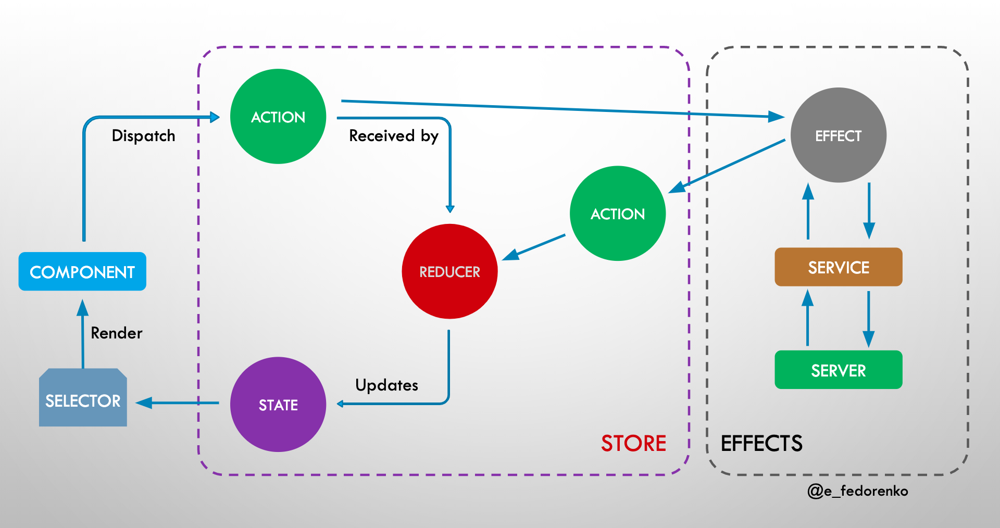

# 如何用63行代码写一个NGRX Store

深入了解 NgRX Store - 通过细节理解其背后的实现。

[原文链接](https://medium.com/angular-in-depth/how-i-wrote-ngrx-store-in-63-lines-of-code-dfe925fe979b)

[原作者:Evgeny Fedorenko](https://twitter.com/e_fedorenko)

译者:[尊重](https://www.zhihu.com/people/yiji-yiben-ming/posts)



# 我爱 NgRx Store

在2017年，我接手了一个 Angular 2 的项目，在那期间，我了解了 Redux 状态管理的理念。在那之前，我花了将近一年的时间实现一个基于 AngularJS 的应用，那是一段痛苦的时光，我丝毫看不到光明的未来。

不仅如此，这个基于 AngularJS 的项目最后失败了，因为包括我在内的开发者不断地过分设计可能已经实现过的功能。这样的方式严重拖慢了发布的时间并最终拖垮了整个项目。

这个项目中包含很多代码问题，其中的大部分都是托 AngularJS 的框架设计所致。问题之一就是状态管理。应用的状态通过众多单例服务离散分布。天知道这些服务注入到了多少组件之中，天知道是哪一个服务改变了某个状态。一团乱麻让人头大。

不得不说，初次接触 Redux 的经历并不轻松。那会儿，我同时学习 Typescript，Rxjs 和 NgRx Store。过程的确很有趣，但也如同在泥潭中挣扎。为了理解在 NgRx 中使用 Typescript 编写的 Observable，我快要把头发都拔光了。但是现如今想起那段回忆，我还是非常享受那段学习的经历。现在，即使所有的难题都汇聚在一起，我也可以说自己对整个流程有了完整的认知。

自那之后，我就变成了一个 Redux 和 NgRx 的忠实拥护者。其技术背后的理念在很多领域和层面上都给我些许启发。一直以来，我对 NgRx 简单的使用方式感到着迷，但是我却从来没有真正意义上深入研究其源码及其构建的方式。特别感谢 [Alex Okrushko](https://medium.com/@alex.okrushko) 提供了所有复杂的 Typescript 泛型，如果没有他的帮助，这些类型定义早就把我吓跑了。

现在，是时候给他来个底朝天了。

## Let’s get it coded

我曾使用一个特别简单的 [Angular NgRx-Seed app](https://stackblitz.com/edit/ngrx-seed) 来帮助自己理解 NgRx：这个应用只包含一个 [reducer](https://ngrx.io/guide/store/reducers) 和 一个 [action](https://ngrx.io/guide/store/actions) ，用于在按钮触发时完成 dispatch；我希望了解 dispatch 是如何调用 reducer 的，以及 [selector](https://ngrx.io/guide/store/selectors) 是如何知晓状态变化的。这里面的一切都是 Rxjs 变的魔法，只是这一次我是魔术师，而不是个观众。现在我将把所有的知识分享给你。

我编写了一个与 NgRx 非常相似但是超极简化版本的 [StoreService](https://gist.github.com/evgenyfedorenko/589f67d3b32afbc035d497dd2a02745e)。该服务覆盖了 dispatching action 的基本功能，accumulating state 以及使用 selector 订阅更新。这段代码仅包含展示意义，无法作为状态管理库的替换工具，请勿在真实环境使用。

查看代码的构造器:

```Typescript
 ...  
  actions$: BehaviorSubject<Action>;
  state$: BehaviorSubject<any>;

  constructor() {
    this.actions$ = new BehaviorSubject({ type: 'INIT' });
    const actionsOnQueue$: Observable<Action> = this.actions$.pipe(observeOn(queueScheduler));
    const reducer$: Observable<
      ActionReducer<any, any>
    > = new BehaviorSubject(reducerFactory(reducers));
    const withLatestReducer$: Observable<
      [Action, ActionReducer<any, Action>]
    > = actionsOnQueue$.pipe(withLatestFrom(reducer$));
    this.state$ = new BehaviorSubject({});

    const stateAndAction$: Observable<
      { state: any; action?: Action; }
    > = withLatestReducer$.pipe(
      scan(reduceState, { state: {} }
      )
    );

    stateAndAction$.subscribe(({ state }) => {
      this.state$.next(state);
    });
  }
  ...
```

> 上述代码中的大部分来自 [state.ts](https://github.com/ngrx/platform/blob/master/modules/store/src/state.ts)

虽然构造器中的代码看起来很多，但是让我们一点点探索。首先是 [BehaviorSubjects](https://rxjs.dev/api/index/class/BehaviorSubject) 和 [queueScheduler](https://rxjs.dev/api/index/const/queueScheduler) 以及一个 [scan](https://rxjs.dev/api/operators/scan) 操作符（scan 操作符也是 NgRx Store 的核心）。如果你对 `queueScheduler` 还不熟悉的话，可以查看[这篇博客](https://blog.cloudboost.io/so-how-does-rx-js-queuescheduler-actually-work-188c1b46526e?source=post_page-----dfe925fe979b----------------------)

简单来说，`queueScheduler` 确保被 dispatch 的 actions 以其初始化时的顺序被同步接收。如果不使用 `queueScheduler` 可能会引起一个 re-entry 的 bug, 最终造成内存溢出。

然后 action$ 通过 [withLatestFrom](https://rxjs.dev/api/operators/withLatestFrom) 操作符与 reducer$ 融合。因为调用 `ReducerManage#addReduce` 可能会动态修改 `reducer$`, 所以留心一下 `reducer$`。虽然在我的日常开发中并不需要这个，但是为了保险起见还是在 `StoreSerive` 中保留了 `addReduce` 的实现。

> 实际上调用 `StoreModule.forFeature` 函数时也会调用 `addReducer` 方法，所以  `addReducer` 方法其实并不那么重要。

## ReducerFactory — connecting the dots

`reducerFactory` 是 NgRx Store 中最复杂的部分。当你尝试去调试它时，会感觉自己在调试一个无休止的闭包。
一切从 store_module.ts 的 [createReducerFactory](https://github.com/ngrx/platform/blob/master/modules/store/src/store_module.ts#L161) 开始。

> 在 StoreService 实现中，为了简化功能，省略了对 [ meta reducers ](https://github.com/ngrx/platform/blob/master/modules/store/src/utils.ts#L95) 处理的实现。

在配置项没有提供自定义配置的情况下，`createReducerFactory` 使用 [combineReducers](https://github.com/ngrx/platform/blob/master/modules/store/src/store_module.ts#L156) 作为默认的工厂函数。该工厂函数会在 [reducer_manager.ts](https://github.com/ngrx/platform/blob/master/modules/store/src/reducer_manager.ts#L35) 中触发。工厂函数会返回一个 reducer 融合函数，该函数最终会作为 `ReducerManager`（实际是一个 BehaviorSubject）的 source，并作为 [ReducerObservable](https://github.com/ngrx/platform/blob/master/modules/store/src/reducer_manager.ts#L108) 注入到 [state.ts](https://github.com/ngrx/platform/blob/master/modules/store/src/state.ts#L26) 文件中。

下面是我使用的 reducerFactory， 通过一个闭包迭代地组合 nextState，nextState 调用了每个可用的应用 reducer 函数，并基于 key 值存储结果。

```Typescript
function reducerFactory(reducers) {
  return function combination(state, action) {
    const nextState: any = {};
    const reducerKeys = Object.keys(reducers);
    for (let i = 0; i < reducerKeys.length; i++) {
      const key = reducerKeys[i];
      const reducer: any = reducers[key];
      nextState[key] = reducer(state[key], action);
    }
    return nextState;
  }
}
```

## Scan 操作符， NgRx Store 的灵魂

使用 scan 操作符将 action$ 和 reducer$ 通过 [withLatestReducer$](https://gist.github.com/evgenyfedorenko/589f67d3b32afbc035d497dd2a02745e#file-store-service-ts-L30) 的形式混合之后，会发生什么呢？ 这里就是 NgRx Store 的核心组成部分 - scan 会保留 stream 的内部状态。scan 操作符包含两个参数 - 累积函数和一个 seed。累计函数包含两个参数：前置状态（每次 stream 更新时都会被累积）以及一个新的状态值。

我实现的累计函数是一个简单的 `reduceState` 函数。每当 action dispatch 或 reducer 更新后，应用的状态都会在这个函数内更新和累积。

```Typescript
function reduceState(stateActionPair = { state: undefined }, [action, reducer]) {
  const { state } = stateActionPair;
  return { state: reducer(state, action), action };
}
```

## Type Unsafe select and createSelector

整体而言，我还需要实现 [select](https://github.com/ngrx/platform/blob/master/modules/store/src/store.ts#L126) 和 [createSelector](https://github.com/ngrx/platform/blob/master/modules/store/src/selector.ts#L113) 函数。但是为了简便，我就不做类型安全功能啦。与 NgRx 库相比，我实现的 StoreService 缺少了不少能力，并不能覆盖方方面面，还望见谅。

下述代码就是我的 select 函数实现：

```typescript
export function select<T, Props, K>(selector: (state: T, props?: Props) => any) {
  return function selectOperator(source$: Observable<T>): Observable<K> {
    let mapped$: Observable<any>;

    mapped$ = source$.pipe(
      map(source => selector(source))
    );

    return mapped$.pipe(distinctUntilChanged());
  };
}
```
该函数接受 selector 作为唯一的参数，在名为 selectOperator 的闭包中，一个叫做 mapped$ 的 state Observable 将会在 map 操作符中调用它。

最后，这是在 reducer 的 index.ts 文件中完成的 createSelector 实现：

```typescript
export function createSelector(...args: any[]) {
  const selectors = args.slice(0, args.length - 1);
  const projector = args[args.length - 1];

  return function (state: any) {
    const args = selectors.map(fn => fn(state));

    return projector.apply(null, args);
  };
}
```

我没有实现任何有关记忆功能的逻辑，因为这个功能复杂到需要另开一篇文章慢慢介绍。此处的实现仅仅是从一个 projector（projector 会接受所有 selectors 的结果） 中分离 selectors 的工具。

## 在一个计数器测试应用中使用 StoreService

现在，让我们将 StoreService 注入到一个 app.component.ts 文件中。在 ngOnInit 钩子中select counter 并将其结果应用在模板中，配合 async pipe 展示数据。像这种从 store 中 select 数据的方式和原始的 NgRx 实现有点不太一样。此处没有通过 Store 的 Observable 订阅 steate$, 而是使用 getState() 实现了同样的功能。

```Typescript
import { Component, OnInit } from '@angular/core';
import { Observable } from 'rxjs';
import * as fromRoot from './reducers/';
import { Increment, Decrement, Reset } from './actions/counter.actions';
import { StoreService, select } from './store.service';

@Component({
  selector: 'my-app',
  templateUrl: './app.component.html',
})
export class AppComponent implements OnInit {
  counter: Observable<number>;

  constructor(
    private storeService: StoreService
  ) { }

  ngOnInit() {
    this.counter = this.storeService.getState().pipe(select(fromRoot.getCount));
  }

  increment() {
    this.storeService.dispatch(new Increment());
  }

  decrement() {
    this.storeService.dispatch(new Decrement());
  }

  reset() {
    this.storeService.dispatch(new Reset());
  }
}
```

除此之外，组件中还包含一些功能，包括 dispatch 诸如 增加，减少和重置的 action。这些功能都恪守了标准，与 NgRx Store 的原生 API 保持一致。

[本文源代码](https://stackblitz.com/edit/ngrx-seed-jdmgsz)

非常感谢你阅读到了这里；我尽我所能的将内容写的直白清晰，希望你可以得到些许收获。如果你有任何问题和评论，请直接给[我](https://twitter.com/e_fedorenko)发消息。