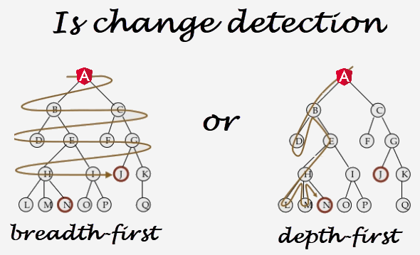
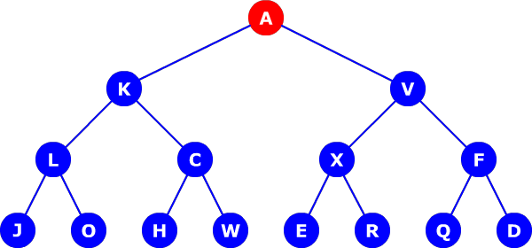
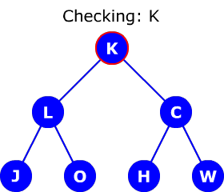

# [翻译] 有人认为变更检测是深度优先，有人认为是广度优先，通常两者都是对的

> 原文: [He who thinks change detection is depth-first and he who thinks it’s breadth-first are both usually right](https://blog.angularindepth.com/he-who-thinks-change-detection-is-depth-first-and-he-who-thinks-its-breadth-first-are-both-usually-8b6bf24a63e6)

> 

曾经有人问我 Angular 中的变更检测是深度优先还是广度优先。这主要是指 Angular 首先检查当前组件的兄弟组件(广度优先)还是子组件(深度优先)。我之前没有考虑过这个问题，所以我只是在用我的直觉和内在的知识。我觉得它是深度优先。稍后，为了验证我的断言，我创建了一个组件树，并在 `ngDoCheck` 钩子中放了些日志逻辑:

```
@Component({
    selector: 'r-comp',
    template: `{{addRender()}}`
})
export class RComponent {
    ngDoCheck() {
        // holds all calls in order and is logged to console
        calls.ngDoCheck.push('R');
    }
```

令我惊讶的是，结果显示，一些兄弟组件首先被检查，如下图所示:


这里你可以看到， Angular 检测了 `K` 然后是 `V`， `L` 然后是 `C`，等等。难道是我错了, 这真的是广度优先算法? 额, 不完全是。在上述陈述中首先要注意的是，这不是个完全地广度优先算法。广度优先算法的常规实现是检查 **同级的所有兄弟组件**，而在上图中，你可以看到该算法确实检查了同级组件 `L` 和 `C`，但是没有检查 `X` 和 `F`，就往下到了 `J` 和 `O`。同样，广度优先的图遍历算法的实现是很明确的，但我在源代码中没找到。于是，我决定进行另一个实验，将日志逻辑放在自定义函数中，当变更检测对表达式求值时调用该函数：

```
@Component({
    selector: 'r-comp',
    template: `{{addRender()}}`
})
export class RComponent {
    addRender() {
        calls.render.push('R');
    }
}
```

这次得出了不同的结果:


这是一个完全的深度优先图遍历算法。那么， 这里发生了什么? 事实上很简单， 我们来看一下。

## 变更检测操作

要理解行为上的差异，我们需要查看变更检测机制在检查组件时执行的操作。如果你已经阅读了 [关于变更检测的我的其他文章](https://blog.angularindepth.com/these-5-articles-will-make-you-an-angular-change-detection-expert-ed530d28930) ， 你可能知道下列变更检测执行的关键操作:

- 更新子组件的属性

- 调用 **子组件** 的 `NgDoCheck`  和  `NgOnChanges` 生命周期钩子

- 更新 **当前组件** 的 DOM

- **对子组件执行变更检测**

我在上面强调了一个有趣的细节——当 Angular 检查当前组件时，调用了**子组件**的生命周期钩子，但是渲染**当前组件** 的 DOM。这是个很重要的区别。如果我们把日志放到 `NgDoCheck` 钩子里，这恰恰是使它看起来就像是算法执行深度优先的原因。当 Angular 检查当前组件时，它会调用所有同级的子组件的生命周期钩子。假设 Angular 现在检查 `K` 组件， 调用了 `L` 和 `C` 组件的 `NgDoCheck` 生命周期钩子。 那么， 我们会得到下图:


看起来像是 广度优先 算法。不过， 记住: Angular 仍然在检测 `K` 组件的过程中。因此，在完成了 `K` 组件的所有操作之后，并没有继续检查同级的 `V` 组件，若检查的话就是广度优先的实现。相反，它继续检查 `L` 组件，`L` 组件是 `K` 的子组件。这是变更检测算法的深度优先实现。就像我们现在知道的，它会调用 `J` and `O` 组件的 `ngDoCheck`，这正是所发生的事情:


结果我的直觉终究没有让我失望。变更检测机制在内部的实现为深度优先， 但是包含首先在兄弟组件上调用`ngDoCheck` 生命周期钩子。顺便说一下， 我已经在 [If you think `ngDoCheck` means your component is being checked — read this article](https://blog.angularindepth.com/if-you-think-ngdocheck-means-your-component-is-being-checked-read-this-article-36ce63a3f3e5) 中深入地描述了这部分逻辑。

## Stackblitz demo

[这里](https://stackblitz.com/edit/depth-or-breadth-first) 你可以在不同地方看到带有日志逻辑的演示
