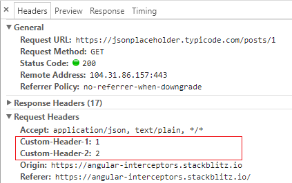
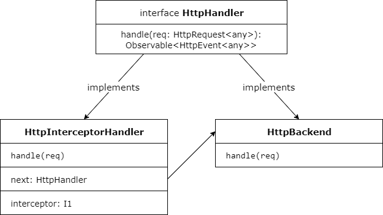
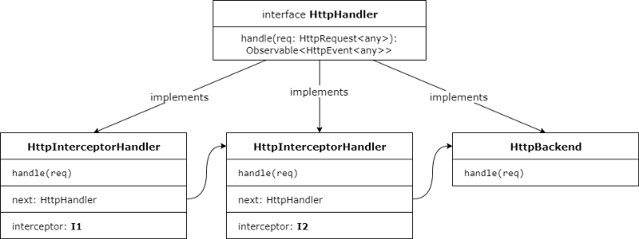

# [翻译] Angular 中拦截器的真相和 HttpClient 内部机制

> 原文：[Insider’s guide into interceptors and HttpClient mechanics in Angular](https://blog.angularindepth.com/insiders-guide-into-interceptors-and-httpclient-mechanics-in-angular-103fbdb397bf)</br>
> 作者：**[Max Koretskyi](http://twitter.com/maxim_koretskyi)**</br>
> 原技术博文由 `Max Koretskyi` 撰写发布，他目前于 [ag-Grid](https://angular-grid.ag-grid.com/?utm_source=medium&utm_medium=blog&utm_campaign=angularcustom) 担任开发大使(Developer Advocate)</br>
*译者按：开发大使负责确保其所在的公司认真听取社区的声音并向社区传达他们的行动及目标，其作为社区和公司之间的纽带存在。*</br>
>译者：**[Ice Panpan](https://github.com/TanYiBing)**；校对者：暂无


您可能知道 Angular 在4.3版本中新引入了[强大的 HttpClient](https://blog.angularindepth.com/the-new-angular-httpclient-api-9e5c85fe3361)。它的一个主要功能是请求拦截（request interception）—— 声明位于应用程序和后端之间的拦截器的能力。[拦截器的文档](https://angular.cn/guide/http)写的很好，展示了如何编写并注册一个拦截器。在这篇文章中，我将深入研究 `HttpClient` 服务的内部机制,特别是拦截器。我相信这些知识对于深入使用该功能是必要的。阅读完本文后，您将能够轻松了解像[缓存](https://angular.cn/guide/http#caching)之类工具的工作流程，并能够轻松自如地实现复杂的请求/响应操作方案。

首先，我们将使用文档中描述的方法来注册两个拦截器，以便为请求添加自定义的请求头。然后我们将实现自定义的中间件链，而不是使用 Angular 定义的机制。最后，我们将了解 `HttpClient` 的请求方法如何构建 `HttpEvents ` 类型的 observable 流并满足[不可变（immutability）性的需求](https://angular.cn/guide/http#immutability)。

与我的大部分文章一样，我们将通过操作实例来学习更多内容。

## 应用示例
首先，让我们实现两个简单的拦截器，每个拦截器使用文档中描述的方法向传出的请求添加请求头。对于每个拦截器，我们声明一个实现了 `intercept` 方法的类。在此方法中，我们通过添加 `Custom-Header-1` 和 `Custom-Header-2` 的请求头信息来修改请求：

```ts
@Injectable()
export class I1 implements HttpInterceptor {
    intercept(req: HttpRequest<any>, next: HttpHandler): Observable<HttpEvent<any>> {
        const modified = req.clone({setHeaders: {'Custom-Header-1': '1'}});
        return next.handle(modified);
    }
}

@Injectable()
export class I2 implements HttpInterceptor {
    intercept(req: HttpRequest<any>, next: HttpHandler): Observable<HttpEvent<any>> {
        const modified = req.clone({setHeaders: {'Custom-Header-2': '2'}});
        return next.handle(modified);
    }
}
```

正如您所看到的，每个拦截器都将下一个处理程序作为第二个参数。我们需要通过调用该函数来将控制权传递给中间件链中的下一个拦截器。我们会很快发现调用 `next.handle` 时发生了什么以及为什么有的时候你不需要调用该函数。此外，如果你一直想知道为什么需要对请求调用 `clone()` 方法，你很快就会得到答案。

拦截器实现之后，我们需要使用 `HTTP_INTERCEPTORS` 令牌注册它们：

```ts
@NgModule({
    imports: [BrowserModule, HttpClientModule],
    declarations: [AppComponent],
    providers: [
        {
            provide: HTTP_INTERCEPTORS,
            useClass: I1,
            multi: true
        },
        {
            provide: HTTP_INTERCEPTORS,
            useClass: I2,
            multi: true
        }
    ],
    bootstrap: [AppComponent]
})
export class AppModule {}
```

紧接着执行一个简单的请求来检查我们自定义的请求头是否添加成功：

```ts
@Component({
    selector: 'my-app',
    template: `
        <div><h3>Response</h3>{{response|async|json}}</div>
        <button (click)="request()">Make request</button>`
    ,
})
export class AppComponent {
    response: Observable<any>;
    constructor(private http: HttpClient) {}

    request() {
        const url = 'https://jsonplaceholder.typicode.com/posts/1';
        this.response = this.http.get(url, {observe: 'response'});
    }
}
```

如果我们已经正确完成了所有操作，当我们检查 `Network` 选项卡时，我们可以看到我们自定义的请求头发送到服务器：



这很容易吧。你可以在 [stackblitz](https://stackblitz.com/edit/angular-interceptors) 上找到这个基础示例。现在是时候研究更有趣的东西了。

## 实现自定义的中间件链
我们的任务是在不使用 `HttpClient` 提供的方法的情况下手动将拦截器集成到处理请求的逻辑中。同时，我们将构建一个处理程序链，就像 Angular 内部完成的一样。

### 处理请求
在现代浏览器中，AJAX 功能是使用 [XmlHttpRequest](https://developer.mozilla.org/en-US/docs/Web/API/XMLHttpRequest) 或 [Fetch API](https://developer.mozilla.org/en-US/docs/Web/API/Fetch_API) 实现的。此外，还有经常使用的会导致[与变更检测相关的意外结果](https://blog.angularindepth.com/do-you-still-think-that-ngzone-zone-js-is-required-for-change-detection-in-angular-16f7a575afef)的 [`JSONP`](http://schock.net/articles/2013/02/05/how-jsonp-really-works-examples/) 技术。Angular 需要一个使用上述方法之一的服务来向服务器发出请求。这种服务在 `HttpClient` 文档上被称为 **后端（backend）**，例如：

>*In an interceptor, next always represents the next interceptor in the chain, if any, or the final backend if there are no more interceptors*
>
>*在拦截器中，`next` 始终表示链中的下一个拦截器（如果有的话），如果没有更多拦截器的话则表示最终后端*

在 Angular 提供的 `HttpClient` 模块中，这种服务有两种实现方法——使用 XmlHttpRequest API 实现的[HttpXhrBackend](https://github.com/angular/angular/blob/6353b77f891d4a74953b23afcf5dd6f64db09a09/packages/common/http/src/xhr.ts#L69) 和使用 JSONP 技术实现的 [JsonpClientBackend](https://github.com/angular/angular/blob/6353b77f891d4a74953b23afcf5dd6f64db09a09/packages/common/http/src/jsonp.ts#L49)。`HttpClient` 中默认使用 `HttpXhrBackend`。

Angular 定义了一个名为 HTTP（request）handler 的抽象概念，负责处理请求。处理请求的中间件链由 HTTP handlers 组成，这些处理程序将请求传递给链中的下一个处理程序，直到其中一个处理程序返回一个 observable 流。处理程序的接口由抽象类 [HttpHandler](https://github.com/angular/angular/blob/6353b77f891d4a74953b23afcf5dd6f64db09a09/packages/common/http/src/backend.ts#L25) 定义：

```ts
export abstract class HttpHandler {
    abstract handle(req: HttpRequest<any>): Observable<HttpEvent<any>>;
}
```

像 [HttpXhrBackend](https://github.com/angular/angular/blob/6353b77f891d4a74953b23afcf5dd6f64db09a09/packages/common/http/src/xhr.ts#L69) 这样可以根据原始请求创建一个网络请求的 backend 就是一个 HTTP handler 的示例。通过和 backend 服务通信来处理请求是最常见的处理形式，但却不是唯一的处理方式。还有一种方法是从本地缓存获取请求而不是创建一个请求。因此，任何可以处理请求的服务都应该实现 `handle` 方法，该方法根据函数签名返回一个 HTTP events 类型的 observable，如 `HttpProgressEvent`，`HttpHeaderResponse` 或`HttpResponse`。因此，如果我们想提供一些自定义请求处理逻辑，我们需要创建一个实现了 `HttpHandler` 接口的服务。

### 使用 backend 作为 HTTP handler
`HttpClient` 服务在 DI 容器中的 HttpHandler 令牌下注入了一个全局的 HTTP handler 。然后通过调用它的 `handle` 方法来发出请求：

```ts
export class HttpClient {
    constructor(private handler: HttpHandler) {}
    
    request(...): Observable<any> {
        ...
        const events$: Observable<HttpEvent<any>> = 
            of(req).pipe(concatMap((req: HttpRequest<any>) => this.handler.handle(req)));
        ...
    }
}
```

默认情况下，全局 HTTP handler 是 [HttpXhrBackend](https://github.com/angular/angular/blob/6353b77f891d4a74953b23afcf5dd6f64db09a09/packages/common/http/src/xhr.ts#L69) backend。它在 `HttpBackend` 令牌下的注入器中注册：

```ts
@NgModule({
    providers: [
        HttpXhrBackend,
        { provide: HttpBackend, useExisting: HttpXhrBackend } 
    ]
})
export class HttpClientModule {}
```

正如你可能猜到的那样 `HttpXhrBackend` 实现了 `HttpHandler` 接口：

```ts
export abstract class HttpHandler {
    abstract handle(req: HttpRequest<any>): Observable<HttpEvent<any>>;
}

export abstract class HttpBackend implements HttpHandler {
    abstract handle(req: HttpRequest<any>): Observable<HttpEvent<any>>;
}

export class HttpXhrBackend implements HttpBackend {
    handle(req: HttpRequest<any>): Observable<HttpEvent<any>> {}
}
```

由于默认的 XHR backend 是在 `HttpBackend` 令牌下注册的，因此我们可以自己注入并替换 `HttpClient` 用于发出请求的用法。所以我们替换掉下面这个使用 `HttpClient` 的版本：

```ts
export class AppComponent {
    response: Observable<any>;
    constructor(private http: HttpClient) {}

    request() {
        const url = 'https://jsonplaceholder.typicode.com/posts/1';
        this.response = this.http.get(url, {observe: 'body'});
    }
}
```

让我们直接使用默认的 XHR backend，如下所示：

```ts
export class AppComponent {
    response: Observable<any>;
    constructor(private backend: HttpXhrBackend) {}

    request() {
        const req = new HttpRequest('GET', 'https://jsonplaceholder.typicode.com/posts/1');
        this.response = this.backend.handle(req);
    }
}
```

[这是示例](https://stackblitz.com/edit/angular-http-backend)。在示例中需要注意一些事项。首先，我们需要手动构建 `HttpRequest`。其次，由于 backend 处理程序返回 HTTP events 流，你将在屏幕上看到不同的对象一闪而过，最终将呈现整个 http 响应对象。

### 添加拦截器
我们已经设法直接使用 backend，但由于我们没有运行拦截器，所以请求头尚未添加到请求中。一个拦截器包含处理请求的逻辑，但它要与 `HttpClient` 一起使用，需要将其封装到实现了 `HttpHandler` 接口的服务中。我们可以通过执行一个拦截器并将链中的下一个处理程序的引用传递给此拦截器的方式来实现此服务。这样拦截器就可以触发下一个处理程序，后者通常是 backend。为此，每个自定义的处理程序将保存链中下一个处理程序的引用，并将其与请求一起传递给下一个拦截器。下面就是我们想要的东西：



在 Angular 中已经存在这种封装处理程序的方法了并被称为 `HttpInterceptorHandler`。让我们用它来封装我们的一个拦截器吧。但是不幸的是，Angular 没有将其导出为公共 API，因此我们只能从[源代码](https://github.com/angular/angular/blob/6353b77f891d4a74953b23afcf5dd6f64db09a09/packages/common/http/src/interceptor.ts#L52)中复制基本实现：

```ts
export class HttpInterceptorHandler implements HttpHandler {
    constructor(private next: HttpHandler, private interceptor: HttpInterceptor) {}

    handle(req: HttpRequest<any>): Observable<HttpEvent<any>> {
        // execute an interceptor and pass the reference to the next handler
        return this.interceptor.intercept(req, this.next);
    }
}
```

并像这样使用它来封装我们的第一个拦截器：

```ts
export class AppComponent {
    response: Observable<any>;
    constructor(private backend: HttpXhrBackend) {}

    request() {
        const req = new HttpRequest('GET', 'https://jsonplaceholder.typicode.com/posts/1');
        const handler = new HttpInterceptorHandler(this.backend, new I1());
        this.response = handler.handle(req);
    }
}
```

现在，一旦我们发出请求，我们就可以看到 `Custom-Header-1` 已添加到请求中。[这是示例](https://stackblitz.com/edit/angular-http-backend-with-one-interceptor?file=app%2Finterceptor-handler.ts)。通过上面的实现，我们将一个拦截器和引用了下一个处理程序的 XHR backend 封装进了 `HttpInterceptorHandler`。现在，这就是这是一条处理程序链。

让我们通过封装第二个拦截器来将另一个处理程序添加到链中：

```ts
export class AppComponent {
    response: Observable<any>;
    constructor(private backend: HttpXhrBackend) {}

    request() {
        const req = new HttpRequest('GET', 'https://jsonplaceholder.typicode.com/posts/1');
        const i1Handler = new HttpInterceptorHandler(this.backend, new I1());
        const i2Handler = new HttpInterceptorHandler(i1Handler, new I2());
        this.response = i2Handler.handle(req);
    }
}
```

[在这可以看到演示](https://stackblitz.com/edit/angular-http-backend-with-one-interceptor)，现在一切正常，就像我们在最开始的示例中使用 `HttpClient` 的那样。我们刚刚所做的就是构建了处理程序的中间件链，其中每个处理程序执行一个拦截器并将下一个处理程序的引用传递给它。这是链的图表：



当我们在拦截器中执行 `next.handle(modified)` 语句时，我们将控制权传递给链中的下一个处理程序：

```ts
export class I1 implements HttpInterceptor {
    intercept(req: HttpRequest<any>, next: HttpHandler): Observable<HttpEvent<any>> {
        const modified = req.clone({setHeaders: {'Custom-Header-1': '1'}});
        // passing control to the handler in the chain
        return next.handle(modified);
    }
}
```

最终，控制权将被传递到最后一个 backend 处理程序，该处理程序将对服务器执行请求。

### 自动封装拦截器
为了不用通过逐个链接拦截器来手动构建这条链，而是通过在 `HTTP_INTERCEPTORS` 令牌下注入所有已注册的拦截器并使用 [reduceRight](https://developer.mozilla.org/en-US/docs/Web/JavaScript/Reference/Global_Objects/Array/ReduceRight) 来自动链接它们。我们这样做：

```ts
export class AppComponent {
    response: Observable<any>;
    constructor(
        private backend: HttpBackend, 
        @Inject(HTTP_INTERCEPTORS) private interceptors: HttpInterceptor[]) {}

    request() {
        const req = new HttpRequest('GET', 'https://jsonplaceholder.typicode.com/posts/1');
        const i2Handler = this.interceptors.reduceRight(
            (next, interceptor) => new HttpInterceptorHandler(next, interceptor), this.backend);
        this.response = i2Handler.handle(req);
    }
}
```

我们需要在这里使用 `reduceRight` 来从最后注册的拦截器开始构建一个链。使用上面的代码，我们会获得与手动构建的处理程序链相同的链。通过 `reduceRight` 返回的值是对链中第一个处理程序的引用。

实际上，在 Angular 中是使用 `interceptingHandler` 函数来实现的。原话是这么说的：

>*Constructs an `HttpHandler` that applies a bunch of `HttpInterceptor`s to a request before passing it to the given `HttpBackend`.
>Meant to be used as a factory function within `HttpClientModule`.*
>
>*构造一个 HttpHandler，在将请求传递给给定的 HttpBackend 之前，将一系列 HttpInterceptor 应用于请求。
>可以在 HttpClientModule 中用作工厂函数。*

（下面顺便贴一下源码:）

```ts
export function interceptingHandler(
    backend: HttpBackend, interceptors: HttpInterceptor[] | null = []): HttpHandler {
  if (!interceptors) {
    return backend;
  }
  return interceptors.reduceRight(
      (next, interceptor) => new HttpInterceptorHandler(next, interceptor), backend);
}
```

现在我们知道 `interceptingHandler` 是如何构造一条处理函数链的了。并且该函数默认为 `HttpHandler`：

```ts
@NgModule({
  providers: [
    {
      provide: HttpHandler,
      useFactory: interceptingHandler,
      deps: [HttpBackend, [@Optional(), @Inject(HTTP_INTERCEPTORS)]],
    }
  ]
})
export class HttpClientModule {}
```

因此，执行此函数的结果是链中第一个处理程序的引用被注入 `HttpClient` 服务并被使用。

## 构建处理链的 observable 流
好的，现在我们知道我们有一堆处理程序，每个处理程序执行一个关联的拦截器并调用链中的下一个处理程序。调用此链返回的值是一个 `HttpEvents` 类型的 observable 流。这个流通常（但不总是）由最后一个处理程序生成，这跟 backend 的具体实现有关。其他的处理程序通常只返回该流。下面是大多数拦截器的最后一个步骤：

```ts
intercept(req: HttpRequest<any>, next: HttpHandler): Observable<HttpEvent<any>> {
    ...
    return next.handle(authReq);
}
```

所以我们可以这样来展示逻辑：


但是因为任何拦截器都可以返回一个 `HttpEvents` 类型的 observable 流，所以你有很多定制机会。例如，你可以实现自己的 backend 并将其注册为拦截器。或者实现一个[缓存机制](https://angular.cn/guide/http#caching)，如果可缓存的请求能够在缓存中找到的话就直接返回，否则只会继续把该请求转发给链表中的下一个处理器：


此外，由于每个拦截器都可以访问下一个拦截器（通过调用 `next.handler()`）返回的 observable 流，因此可以通过 RxJs 操作符添加自定义的逻辑来修改返回的流。

## 构建 HttpClient 的 observable 流
如果您仔细阅读了前面的部分，那么您现在可能想知道处理链创建的 HTTP events 流是否与调用 `HttpClient` 方法，如 `get` 或者 `post` 所返回的流完全相同。咦...不是！实现的过程更有意思。

`HttpClient` 通过使用 `of` 这种创造性的 `RxJs` 操作符来将请求对象变为 observable 流，并在调用 `HttpClient` 的 HTTP `request` 方法时返回它。**处理程序链作为此流的一部分被同步处理，并且使用 `concatMap` 操作符压平链返回的 observable**。[实现的关键点](https://github.com/angular/angular/blob/6353b77f891d4a74953b23afcf5dd6f64db09a09/packages/common/http/src/client.ts#L386)就在 `request` 方法，因为所有的 API 方法像 `get`，`post` 或 `delete`只是包装了 `request` 方法：

```ts
const events$: Observable<HttpEvent<any>> = of(req).pipe(
    concatMap((req: HttpRequest<any>) => this.handler.handle(req))
);
```

在上面的代码片段中，我用 `pipe` 替换了旧技术 `call`。如果您仍然对 `concatMap` 如何工作感到困惑，你可以阅读[学习将 RxJs 序列与超级直观的交互式图表相结合](https://blog.angularindepth.com/learn-to-combine-rxjs-sequences-with-super-intuitive-interactive-diagrams-20fce8e6511)。有趣的是，为什么处理程序链在以 `of` 方法开始的 observable 流中被执行了呢？这里有一个解释：

>*Start with an Observable.of() the initial request, and run the handler (which includes all interceptors) inside a concatMap(). This way, the handler runs inside an Observable chain, which causes interceptors to be re-run on every subscription (this also makes retries re-run the handler, including interceptors).*
>
>*通过 Observable.of() 初始请求，并在 concatMap() 中运行处理程序（包括所有拦截器）。这样，处理程序就在一个 Observable 链中运行，这会使得拦截器会在每个订阅上重新运行（这样重试的时候也会重新运行处理程序，包括拦截器）。*

### 处理 ‘observe’ 请求选项
通过 `HttpClient` 创建的初始 observable 流,发出了所有的 HTTP events，如 `HttpProgressEvent`，`HttpHeaderResponse` 或 `HttpResponse`。但是从文档中我们知道我们可以通过设置 observe 选项来指定我们感兴趣的事件：

```ts
request() {
    const url = 'https://jsonplaceholder.typicode.com/posts/1';
    this.response = this.http.get(url, {observe: 'body'});
}
```

使用 `{observe: 'body'}` 后，从 `get` 方法返回的 observable 流只会发出响应中 `body` 部分的内容。 `observe` 的其他选项还有 `events` 和 `response` 并且 `response` 是默认选项。在探索处理程序链的实现的一开始，我就指出过调用处理程序链返回的流会发出**所有** HTTP events。根据 `observe` 的参数过滤这些 events 是 `HttpClient` 的责任。

这意味着我在上一节中演示 `HttpClient` 返回流的实现需要稍微调整一下。我们需要做的是过滤这些 events 并根据 `observe` 参数值将它们映射到不同的值。接下来简单实现下：

```ts

const events$: Observable<HttpEvent<any>> = of(req).pipe(...)

if (options.observe === 'events') {
    return events$;
}

const res$: Observable<HttpResponse<any>> =
    events$.pipe(filter((event: HttpEvent<any>) => event instanceof HttpResponse));

if (options.observe === 'response') {
    return res$;
}

if (options.observe === 'body') {
    return res$.pipe(map((res: HttpResponse<any>) => res.body));
}
```

[在这里](https://github.com/angular/angular/blob/6353b77f891d4a74953b23afcf5dd6f64db09a09/packages/common/http/src/client.ts#L403)，您可以找到源码。

## 不可变性的需要
[文档上关于不变性](https://angular.cn/guide/http#immutability)的一个有趣的段落是这样的：

>*Interceptors exist to examine and mutate outgoing requests and incoming responses. However, it may be surprising to learn that the HttpRequest and HttpResponse classes are largely immutable. This is for a reason: because the app may retry requests, the interceptor chain may process an individual request multiple times. If requests were mutable, a retried request would be different than the original request. Immutability ensures the interceptors see the same request for each try.*
>
>*虽然拦截器有能力改变请求和响应，但 HttpRequest 和 HttpResponse 实例的属性却是只读（readonly）的，因此，它们在很大意义上说是不可变对象。有充足的理由把它们做成不可变对象：应用可能会重试发送很多次请求之后才能成功，这就意味着这个拦截器链表可能会多次重复处理同一个请求。 如果拦截器可以修改原始的请求对象，那么重试阶段的操作就会从修改过的请求开始，而不是原始请求。 而这种不可变性，可以确保这些拦截器在每次重试时看到的都是同样的原始请求。*

让我详细说明一下。当您调用 `HttpClient` 的任何 HTTP 请求方法时，就会创建请求对象。正如我在前面部分中解释的那样，此请求用于生成一个 `events$` 的 observable 序列，并且在订阅时，它会在处理程序链中被传递。但是 `events$` 流可能会被重试，这意味着可以在序列外部创建原始请求对象的情况下多次触发序列。但拦截器应始终以原始请求开始。如果请求是可变的并且可以在拦截器运行期间进行修改，则对于下一次拦截器运行，情况会变得不可预测。由于同一请求对象的引用将多次用于开始 observable 序列，所以请求及其所有组成部分，如 `HttpHeaders` 和 `HttpParams` 应该是不可变的。